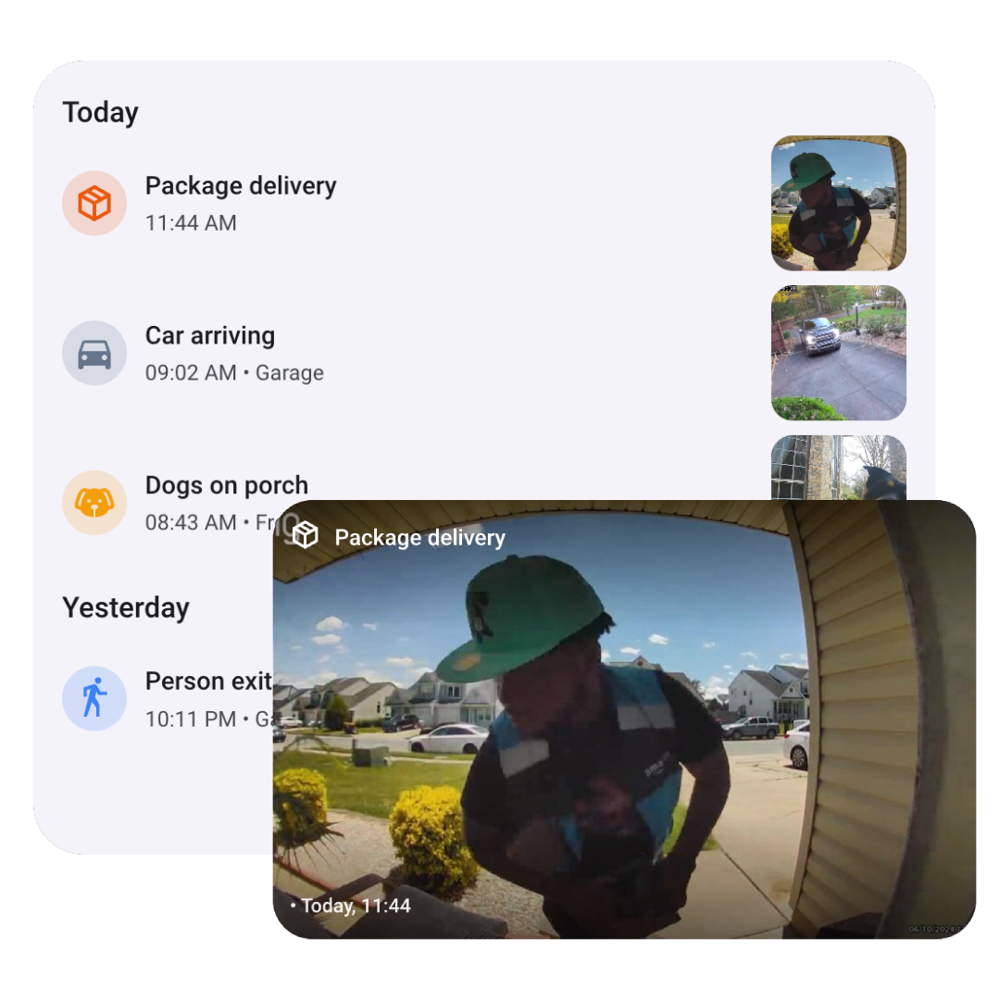
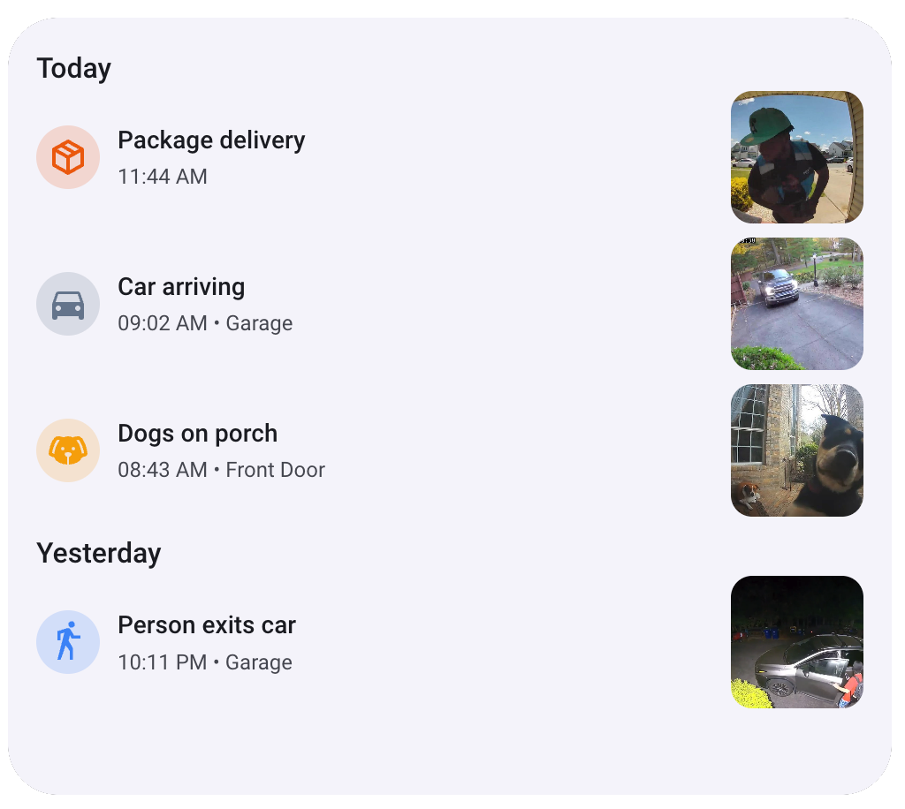
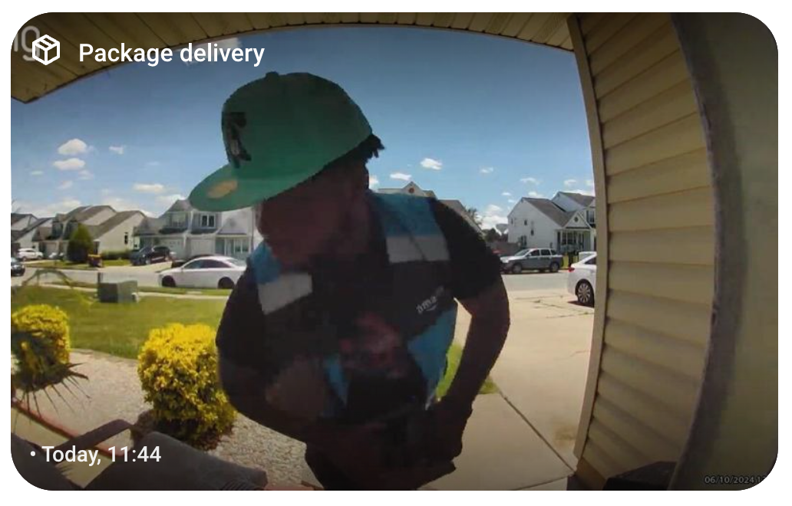

<p align="center">
<picture>
  <source media="(prefers-color-scheme: dark)" srcset="./logos/dark_logo@2x.png">
  
</picture></p>
<h1 align=center>Timeline Card</h1>
<p align=center>


    <p align=center style="font-weight:bold">
      Custom Card to display the LLM Vision Timeline on your Home Assistant Dashboard
    </p>
</p>

  <p align="center">
    <a href="#prerequisites">🌟 Prerequisites </a>
    ·
    <a href="#installation">⬇️ Installation</a>
    ·
    <a href="#setup">🚧 Setup</a>
    ·
    <a href="#configuration">🔧 Configuration</a>
  </p>
<p align="center">
  <a href="https://llmvision.org/card"> Visit Website →</a>
    </p>

<p align="center">
<picture>
  <source media="(prefers-color-scheme: dark)" srcset="./assets/cards-hero-dark.png">
  
</picture></p>

## Prerequisites
1. [LLM Vision](https://github.com/valentinfrlch/ha-llmvision) set up in Home Assistant
2. Timeline provider set up in LLM Vision
3. Blueprint or Automation to add events to the timeline

## Documentation
<a href="https://llm-vision.gitbook.io/getting-started/setup/timeline-card-beta"> </a>

## Installation
Add the repository to HACS and install the LLM Vision card using this link:
[](https://my.home-assistant.io/redirect/hacs_repository/?owner=valentinfrlch&repository=llmvision-card&category=plugin)

Alternatively you can add the url of this repository to the custom repositories list in HACS.

## Setup
1. Install the card through HACS
2. Reload
3. Add the card to your dashboard

# Configuration
## Timeline Card
<picture>
  <source media="(prefers-color-scheme: dark)" srcset="./assets/timeline-dark.png">
  
</picture>

| Parameter         | Description                                                                                                 | Default                      |
|-------------------|-------------------------------------------------------------------------------------------------------------|------------------------------|
| header            | Shows a header (title) at the top of the card. Hidden when empty.                                           |
| number_of_events  | How many events to show.                                                                                    | 100                          |
| number_of_days    | Show events that occurred within the past specified number of days.                                         | 30                           |
| category_filters  | Only show events matching one of the specified categories.                                                  | `[]`                         |
| camera_filters    | Only show events matching one of the specified cameras.                                                     | `[]`                         |
| filter_false_positives       | Show or hide activities titles "no activity" | `false`                         |
| language          | Language used for the card UI (supports: `bg`, `ca`, `cs`, `de`, `en`, `es`, `fr`, `hu`, `it`, `nl`, `pl`, `pt`, `sk`, `sv`)    | `en`                         |
| time_format       | 12h or 24h time format. | `24h`                         |
| default_icon       | Icon to use when event couldn't be classified | `mdi:motion-sensor`                         |
| custom_colors     | Custom colors for categories. Colors must be specified as a dictionary where keys are category names and values are lists of RGB values (e.g., `[255, 255, 0]`). See the example configuration below for details.    | `[]`                         |


### Example Configuration
```yaml
type: custom:llmvision-card
number_of_days: 365
number_of_events: 100
category_filters: []
camera_filters: []
default_icon: mdi:motion-sensor
language: en
time_format: 12h
filter_false_positives: true
```

## Preview Card
<picture>
  <source media="(prefers-color-scheme: dark)" srcset="./assets/preview.png">
  
</picture>

| Parameter         | Description                                                                                                 | Default                      |
|-------------------|-------------------------------------------------------------------------------------------------------------|------------------------------|
| category_filters  | Only show events matching one of the specified categories.                                                  | `[]`                         |
| camera_filters    | Only show events matching one of the specified cameras.                                                     | `[]`                         |
| filter_false_positives       | Show or hide activities titles "no activity" | `false`                         |
| language          | Language used for the card UI (supports: `bg`, `ca`, `cs`, `de`, `en`, `es`, `fr`, `hu`, `it`, `nl`, `pl`, `pt`, `sk`, `sv`)    | `en`                         |
| time_format       | 12h or 24h time format. | `24h`                         |
| default_icon       | Icon to use when event couldn't be classified | `mdi:motion-sensor`                         |

### Example Configuration
```yaml
type: custom:llmvision-preview-card
language: en
time_format: 12h
category_filters:
  - people
camera_filters:
  - camera.garage
```

## Providing Feedback
You can submit feedback for events to help make LLM Vision better for everyone. This helps us understand, what our users expect from a good event description.
<picture>

</picture>

To provide feedback:
1. Click on any event in the timeline or the preview card
2. Click the three dots
3. In the menu, select either thumbs up or thumbs down, depending on how good the response is.
4. If you selected thumbs down, select a reason and follow the remaining steps.


## Support
You can support this project by starring this GitHub repository. If you want, you can also buy me a coffee here:
<br>
<a href="https://www.buymeacoffee.com/valentinfrlch"></a>
